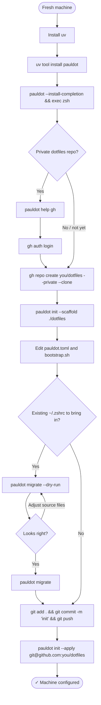
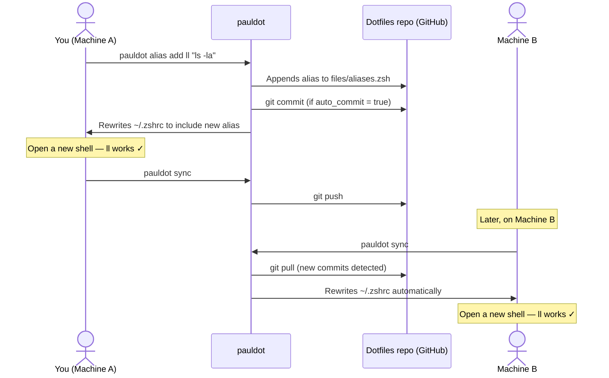
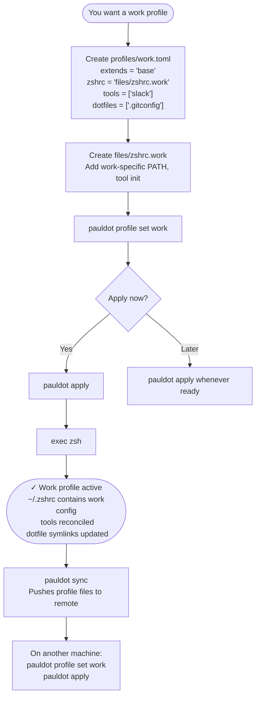
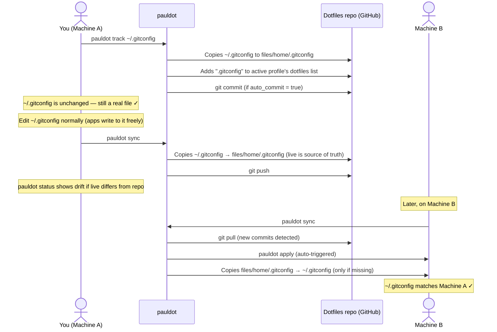

# Pauldot Refactor Spec

**Based on:** ANALYSIS.md comparative assessment
**Status:** Proposed — not yet implemented
**Date:** 2026-05-06

---

## 0. Scope Clarification

### What pauldot manages after this refactor

- `~/.zshrc` — generated by concatenating source files (zsh only; no bash/fish support)
- Shell aliases (`files/aliases.zsh`) — zsh only
- Environment variables (`files/.env.generated`) — zsh only
- Tool installation reconciliation (`tools/tools.toml`)
- **Arbitrary dotfiles** — tracked via copy-on-sync (new feature, see section 2)

### What is explicitly out of scope

- Other shell configs (bash, fish, etc.) — pauldot is a zsh tool, that's a feature not a gap
- Template engines for machine-specific file content (Go templates, etc.) — the profile system handles this
- Secrets management / password manager integration — out of scope
- Windows support — macOS/Linux only

---

## 1. The Core Problem: The Generated-File Model

### 1.1 What it does today

`pauldot apply` writes `~/.pauldot/files/.zshrc.generated` — a file containing `source` lines pointing to real source files — then symlinks `~/.zshrc` to it.

```
~/.zshrc  →  ~/.pauldot/files/.zshrc.generated
```

`.zshrc.generated` contains:
```zsh
# Generated by pauldot. Do not edit directly.
source /home/paul/.pauldot/files/zshrc.base
source /home/paul/.pauldot/files/aliases.zsh
[ -f /home/paul/.pauldot/files/.env.generated ] && source /home/paul/.pauldot/files/.env.generated
```

### 1.2 Why this is wrong

**Problem A — External tools write to the wrong place.** Tools like pyenv, nvm, and Homebrew detect `~/.zshrc` and append their init lines to it. Because `~/.zshrc` is a symlink to `.zshrc.generated`, those tools append to `.zshrc.generated` — a file inside the dotfiles repo that is supposed to be generated output. This creates drift between the generated output and the source files. The `absorb` command exists entirely to paper over this problem.

**Problem B — The model is invisible.** When a user's shell breaks, they open `~/.zshrc`. They see a "do not edit" file that sources other files from a hidden directory. The source of truth is not where they looked. This breaks the most basic debugging loop.

**Problem C — Inconsistent apply semantics.** Editing `files/zshrc.base` takes effect at the next shell start without running `pauldot apply` (because `~/.zshrc` sources it directly). But editing profile TOML requires `pauldot apply`. The rule "do I need to apply?" depends on what you edited, with no obvious signal.

**Problem D — Drift detection is unreliable.** `absorb.py` uses a prefix-match heuristic and falls back to a set-diff. This is fragile. The tool isn't sure what the file should contain because the file contains references (source lines), not content.

### 1.3 The fix: pauldot as a content engine

Pauldot should be an engine that takes source files as input and produces `~/.zshrc` as output. The output is the actual, full, concatenated content — not a file of `source` lines. `~/.zshrc` is a plain file, not a symlink.

**New model:**
```
~/.pauldot/files/zshrc.base   ─┐
~/.pauldot/files/aliases.zsh  ─┼──[ pauldot apply ]──► ~/.zshrc  (plain file)
~/.pauldot/files/.env.generated─┘
```

**Properties of the new model:**
- `pauldot apply` is always needed after any source file edit (consistent rule)
- `~/.zshrc` contains real shell code, readable and debuggable
- External tools appending to `~/.zshrc` creates detectable drift
- `pauldot status` diffs generated content vs. actual `~/.zshrc` content — always reliable
- `pauldot absorb` is simpler: the diff is content vs. content, no heuristics needed
- The `.zshrc.generated` file in the repo is deleted; it served no purpose in the new model

---

## 2. New Feature: Dotfile Tracking

### 2.1 Motivation

Pauldot currently manages one file — `~/.zshrc`. On a new machine, everything else (`.gitconfig`, `.vimrc`, starship config, editor settings) still has to be set up manually. Adding dotfile tracking rounds out the "new machine in minutes" promise without expanding pauldot's conceptual surface area.

**The model is copy-on-sync, not symlinks.** The live file at `$HOME` is always the source of truth. Apps (editors, package managers, git itself) write to the live path and expect a real file there — symlinks confuse tools that resolve the canonical path before writing. Pauldot tracks which files it knows about, copies the live version into the repo on `sync`, and bootstraps the live file from the repo copy on `apply` if it doesn't exist yet.

This is the same philosophy as the alias manager: aliases live in `aliases.zsh` (a real file), not in a pauldot-internal format. Tracked dotfiles live at their real `$HOME` paths, not in a pauldot directory.

### 2.2 Repo storage layout

Tracked dotfiles are stored under `~/.pauldot/files/home/`, preserving their path relative to `$HOME`:

```
live: ~/.gitconfig                →  repo: ~/.pauldot/files/home/.gitconfig
live: ~/.config/starship.toml     →  repo: ~/.pauldot/files/home/.config/starship.toml
live: ~/.vimrc                    →  repo: ~/.pauldot/files/home/.vimrc
```

Rule: strip `~` from the path; prepend `files/home`. Directories are created as needed.

### 2.3 Config: dotfiles list per profile

Add a `dotfiles` field to `ProfileConfig` in `config.py`:

```python
class ProfileConfig(pydantic.BaseModel):
    extends: str | None = None
    zshrc: str | None = None
    tools: list[str] = pydantic.Field(default_factory=list)
    env: dict[str, str] = pydantic.Field(default_factory=dict)
    dotfiles: list[str] = pydantic.Field(default_factory=list)  # paths relative to $HOME
```

Example profile TOML:
```toml
# profiles/personal.toml
zshrc = "files/zshrc.base"
tools = ["uv", "git", "starship"]
dotfiles = [".gitconfig", ".config/starship.toml", ".vimrc"]
```

Dotfiles lists merge via `extends` (same as `tools`): parent dotfiles first, then child.

Update `ResolvedProfile` in `profiles.py`:
```python
class ResolvedProfile(pydantic.BaseModel):
    name: str
    zshrc_files: list[pathlib.Path]
    tools: list[str]
    env: dict[str, str]
    dotfiles: list[str]  # paths relative to $HOME, parent-first
```

Update `profiles.resolve()` to merge `dotfiles` from parent and child (same pattern as `tools`).

### 2.4 New module: dotfiles.py

Three operations, three result types.

**Status — compare live vs repo**

```python
class DotfileStatus(pydantic.BaseModel):
    path: str   # relative to $HOME
    state: typing.Literal["in_sync", "drift", "not_in_repo", "not_on_disk"]
```

**`status(dotfiles: list[str], home: pathlib.Path, repo_path: pathlib.Path) → list[DotfileStatus]`**

For each `home_rel` in `dotfiles`:
1. `repo_file = repo_path / "files" / "home" / home_rel`
2. `live = home / home_rel`
3. If `repo_file` doesn't exist → `"not_in_repo"` (run `pauldot track`)
4. If `live` doesn't exist → `"not_on_disk"` (run `pauldot apply` to bootstrap)
5. If contents match → `"in_sync"`
6. Else → `"drift"` (live has changed; run `pauldot sync` to update repo)

**Apply — bootstrap live file from repo (new machine)**

```python
class DotfileApplyResult(pydantic.BaseModel):
    path: str
    action: typing.Literal["copied", "already_present", "missing_source"]
```

**`apply_dotfiles(dotfiles: list[str], home: pathlib.Path, repo_path: pathlib.Path, dry_run: bool) → list[DotfileApplyResult]`**

For each `home_rel` in `dotfiles`:
1. `repo_file = repo_path / "files" / "home" / home_rel`
2. `live = home / home_rel`
3. If `repo_file` doesn't exist → `"missing_source"` (warn; skip)
4. If `live` exists → `"already_present"` (live is source of truth — never overwrite)
5. Else → if not dry_run: `live.parent.mkdir(parents=True, exist_ok=True)`, copy `repo_file` → `live` → `"copied"`

**Sync — copy live files into repo**

```python
class DotfileSyncResult(pydantic.BaseModel):
    path: str
    action: typing.Literal["synced", "no_change", "missing_live"]
```

**`sync_dotfiles(dotfiles: list[str], home: pathlib.Path, repo_path: pathlib.Path, dry_run: bool) → list[DotfileSyncResult]`**

For each `home_rel` in `dotfiles`:
1. `repo_file = repo_path / "files" / "home" / home_rel`
2. `live = home / home_rel`
3. If `live` doesn't exist → `"missing_live"` (warn; nothing to sync)
4. If contents match → `"no_change"`
5. Else → if not dry_run: `repo_file.parent.mkdir(parents=True, exist_ok=True)`, copy `live` → `repo_file` → `"synced"`

**`repo_path_for(home_rel: str, repo_path: pathlib.Path) → pathlib.Path`**
Returns `repo_path / "files" / "home" / home_rel`. Used by `track`.

### 2.5 New command: pauldot track

```
pauldot track <path>
```

`path` can be absolute (`~/.gitconfig`) or relative to `$HOME` (`.gitconfig`). The command:

1. Resolves `path` to an absolute path and computes `home_rel` (relative to `$HOME`)
2. Validates that `path` exists and is a regular file
3. Copies the file to `repo_path / "files" / "home" / home_rel` (creates parent dirs)
4. Adds `home_rel` to the active profile's `dotfiles` list in the profile TOML
5. Prints confirmation; does NOT remove or replace the original file
6. If `auto_commit`: commits with message `"pauldot: track <home_rel>"`

If the file is already listed in the profile's `dotfiles` → print warning, exit 0.

**Implementation:** Add `track` command to `cli.py`; add helper `add_dotfile_to_profile(repo_path, profile_name, home_rel)` to `config.py` that rewrites the profile TOML with the new entry appended to `dotfiles`.

### 2.6 apply.py: bootstrap dotfiles on new machines

Extend `ApplyResult`:
```python
class ApplyResult(pydantic.BaseModel):
    zshrc: zshrc.ZshrcResult
    tools: list[tools.ToolResult]
    dotfiles: list[dotfiles.DotfileApplyResult]
```

In `apply.run()`, after tool reconciliation:
```python
dotfile_results = dotfiles.apply_dotfiles(profile.dotfiles, home, repo_path, dry_run=dry_run)
```

This copies repo files → live only for files that don't yet exist. On an already-configured machine most results will be `"already_present"`.

Return in `ApplyResult`.

### 2.7 sync command: copy live dotfiles into repo

Before `git.commit_all()` / `git.push()`, call `dotfiles.sync_dotfiles()` to pull live files into the repo. This is what makes the live file the source of truth: sync always overwrites the repo copy with whatever is on disk.

Updated sync flow:
1. `dotfiles.sync_dotfiles(profile.dotfiles, home, repo_path)` — copy live → repo
2. `git.pull_rebase(repo_path)` — pull remote changes
3. If new commits: `apply.run(home, dry_run=False)` — bootstrap any dotfiles that don't exist locally
4. `git.commit_all(repo_path, ...)` + `git.push(repo_path)` — push updated dotfiles

Print dotfile sync results alongside the git output.

### 2.8 CLI output for dotfiles

**apply** — in `_print_apply_result`, show dotfile results if any exist:

```
~/.gitconfig             ✓ copied
~/.config/starship.toml  ✓ already present
~/.vimrc                 ⚠ missing source
```

**sync** — print sync results before git output:

```
~/.gitconfig             ✓ synced
~/.config/starship.toml  ✓ no change
```

**status** — in the dry-run apply output, include dotfile drift:

```
~/.gitconfig             ✓ in sync
~/.config/starship.toml  ⚠ drift  (live differs from repo — run pauldot sync)
~/.vimrc                 ⚠ not on disk (run pauldot apply to bootstrap)
```

### 2.9 doctor: check dotfile presence

Extend `pauldot doctor` to check each tracked dotfile:
- Live file exists and matches repo copy → ok
- Live file exists but differs from repo → warn, "run `pauldot sync`"
- Live file missing → warn, "run `pauldot apply`"
- Repo copy missing → warn, "run `pauldot track <path>`"

### 2.10 Untrack (future, not in this refactor)

`pauldot untrack <path>` is useful but is a follow-on. For now, the user can manually:
1. Remove the entry from the profile TOML
2. Delete the repo copy from `files/home/`

The live file is unaffected — it was never replaced.

Document this in a comment in the profile TOML template.

---

## 3. Changes: zshrc.py

### 3.1 Remove

- `GENERATED_ZSHRC_REL` constant — the generated file no longer lives in the repo
- `generate_zshrc()` — it wrote to the repo path; no longer needed
- The symlink logic from `apply_zshrc()` — we write a plain file now

### 3.2 Add/rewrite

**`PAULDOT_HEADER`** — module-level constant:
```python
PAULDOT_HEADER = "# Generated by pauldot."
```
This is the first line of every `~/.zshrc` pauldot writes. Its presence is how pauldot detects ownership.

**`expected_content(repo_path, profile) → str`** — keep this function signature; change the body.

Current body: generates `source` lines.
New body: concatenates the actual text of source files.

```
# Generated by pauldot.
# Edit source files in ~/.pauldot/files/ — do not edit this file directly.
# Run `pauldot absorb` if external tools have appended lines here.

<content of each profile zshrc file, in order>

<content of files/aliases.zsh, if it exists>

<content of files/.env.generated, if it exists>
```

Each section is separated by a blank line. No `source` lines. No absolute paths in the content (those live in the source files themselves if needed).

Section comments (e.g., `# --- zshrc.base ---`) are optional and add noise. Omit them. The header comment is sufficient.

**`apply_zshrc(home, profile, dry_run) → ZshrcResult`** — rewrite signature (removes the `target: pathlib.Path` argument).

Logic:
1. Generate expected content via `expected_content(repo_path, profile)` — need `repo_path` in scope; thread it through or load from `home / ".pauldot"`.
2. `zshrc = home / ".zshrc"`
3. If `zshrc.is_symlink()`: this is a migration case (old model). Remove the symlink; treat as no existing file for the next step. (No backup needed — we wrote the target.)
4. If `zshrc.exists()`:
   - Read content.
   - If content starts with `PAULDOT_HEADER`: this is our file.
     - If content == expected: return `ZshrcResult(action="no_op", ...)`
     - Else: overwrite with expected; return `ZshrcResult(action="written", ...)`
   - If content does NOT start with `PAULDOT_HEADER`: backup to `~/.zshrc.bak.<timestamp>`, write expected; return `ZshrcResult(action="backup_replaced", backup=<path>, ...)`
5. If `zshrc` does not exist: write expected; return `ZshrcResult(action="created", ...)`

**`ZshrcResult`** — update the `action` literal:

```python
action: typing.Literal["created", "written", "no_op", "backup_replaced"]
```

Remove `"replaced"` (it was "symlink points elsewhere — replace it" which no longer applies).
Add `"written"` (content was stale and was updated).
Keep `"created"`, `"no_op"`, `"backup_replaced"`.

Update the labels in `cli.py` (`_ZSHRC_ACTION_LABELS`) to match.

### 3.3 apply.py changes

Current `run()`:
```python
target = zshrc.generate_zshrc(repo_path, profile)   # writes to repo
zshrc_result = zshrc.apply_zshrc(home, target, dry_run=dry_run)  # symlinks
```

New `run()`:
```python
zshrc_result = zshrc.apply_zshrc(home, repo_path, profile, dry_run=dry_run)
```

Pass `repo_path` and `profile` directly; no intermediate `target` path. The function generates content internally.

### 3.4 doctor changes

Remove the symlink check:
```python
# OLD: checks that ~/.zshrc is a symlink pointing to the generated file
if zshrc_link.is_symlink() and zshrc_link.resolve() == generated.resolve(): ...
```

Replace with:
```python
# NEW: checks that ~/.zshrc exists and is pauldot-owned
if zshrc_link.exists() and not zshrc_link.is_symlink():
    content = zshrc_link.read_text()
    if content.startswith(zshrc.PAULDOT_HEADER):
        ok("~/.zshrc", "managed by pauldot")
    else:
        warn("~/.zshrc", "exists but not managed by pauldot — run `pauldot apply`")
elif zshrc_link.is_symlink():
    warn("~/.zshrc", "is a symlink (old pauldot model) — run `pauldot apply` to migrate")
else:
    warn("~/.zshrc", "not found — run `pauldot apply`")
```

---

## 4. Changes: absorb.py

The existing `absorb.py`
 diffs `.zshrc.generated` (the file in the repo) against what pauldot would generate, looking for lines that external tools added. In the new model, `.zshrc.generated` is gone. The diff is now between `~/.zshrc` (the actual live file) and what `expected_content()` would produce.

This makes absorb simpler. The prefix-match heuristic and fallback set-diff can both be replaced with a direct content comparison, because both sides are now actual shell content (not `source` lines vs actual content).

### 4.1 New absorb logic

```python
def absorb(home, repo_path, target_name="zshrc.base", dry_run=False) -> AbsorbResult:
    zshrc_path = home / ".zshrc"
    if not zshrc_path.exists():
        raise FileNotFoundError("~/.zshrc not found. Run `pauldot apply` first.")
    if not zshrc_path.read_text().startswith(zshrc.PAULDOT_HEADER):
        raise ValueError("~/.zshrc is not managed by pauldot. Run `pauldot apply` first.")

    current_state = state.load_state()
    profile = profiles.resolve(repo_path, current_state.active_profile)

    actual = zshrc_path.read_text()
    expected = zshrc.expected_content(repo_path, profile)
    extra = _extra_lines(actual, expected)

    if not extra or dry_run:
        return AbsorbResult(lines=extra, target=None, dry_run=dry_run)

    target = repo_path / "files" / target_name
    with target.open("a") as f:
        f.write("\n# Absorbed by pauldot absorb\n")
        for line in extra:
            f.write(line + "\n")

    return AbsorbResult(lines=extra, target=target, dry_run=dry_run)
```

### 4.2 New `_extra_lines`

Because both sides are now real content (not source-line indirections), the comparison is straightforward:

```python
def _extra_lines(actual: str, expected: str) -> list[str]:
    expected_lines = set(expected.splitlines())
    return [
        line for line in actual.splitlines()
        if line not in expected_lines and line.strip()
    ]
```

Comments are included — if a tool appended a comment to `~/.zshrc`, it gets absorbed into the source file along with the functional lines.

---

## 5. Changes: edit auto-apply

Currently `pauldot edit <target>` opens a file in `$EDITOR` and exits. The user must separately run `pauldot apply`.

In the new model, `pauldot apply` is always required after any source file edit (not optional as before). To reduce friction, the `edit` command should apply automatically after the editor exits for the targets that affect `~/.zshrc` output.

### 5.1 Which targets trigger auto-apply

| `pauldot edit` target | Affects `~/.zshrc` output? | Auto-apply |
|---|---|---|
| `zshrc` | yes (content of zshrc file changes) | yes |
| `profile` | yes (tools list, zshrc selection, env may change) | yes |
| `tools` | no (tool definitions don't affect zshrc) | no |
| `pauldot` | no (pauldot.toml doesn't affect zshrc content) | no |

### 5.2 Implementation in cli.py

```python
if target in ("zshrc", "profile"):
    subprocess.run([editor, str(path)])
    # Apply after edit — source content changed.
    try:
        result = pauldot_apply.run(pathlib.Path.home())
        _print_apply_result(result, dry_run=False)
    except (FileNotFoundError, RuntimeError) as e:
        console.print(f"[yellow]⚠[/yellow] Apply failed after edit: {e}")
else:
    subprocess.run([editor, str(path)])
```

The apply failure is a warning, not a hard error — the user may have made an intentional partial edit.

---

## 6. Changes: init

### 6.1 Problem

`pauldot init` clones the repo and saves state but does not apply. The user must remember to run `pauldot apply` as a second step. If they don't, their shell is not yet configured.

`BOOTSTRAP_HELP` in `help_text.py` explicitly lists this as two separate steps (4. init, 5. apply). That should not be necessary.

### 6.2 Change

Add an `--apply` flag to `init`. At the end of a successful init, either:
- Prompt: `"Apply now? [Y/n]"` (default yes), or
- If `--apply` is passed: skip the prompt and apply immediately

The single-command new-machine workflow becomes:
```
pauldot init --apply git@github.com:paulhallett/dotfiles
```

### 6.3 Implementation in cli.py

```python
@app.command()
def init(
    repo_url: ...,
    scaffold_path: ...,
    apply_after: typing.Annotated[
        bool, typer.Option("--apply", help="Run apply immediately after init.")
    ] = False,
) -> None:
```

After `state.save_state(...)`:

```python
if apply_after or typer.confirm("Apply now?", default=True):
    try:
        result = pauldot_apply.run(home)
        _print_apply_result(result, dry_run=False)
    except (FileNotFoundError, RuntimeError) as e:
        console.print(f"[red]Error during apply:[/red] {e}")
        raise typer.Exit(1) from None
else:
    console.print("\nRun `pauldot apply` when ready.")
```

Remove the `"\nRun `pauldot apply` when ready."` line from the non-apply path — it's now printed only when the user declines.

### 6.4 Update BOOTSTRAP_HELP

Collapse steps 4 and 5 into:
```
4. Clone your dotfiles repo and apply:
     pauldot init --apply git@github.com:<you>/dotfiles

5. Open a new shell to pick up the new ~/.zshrc:
     exec zsh
```

---

## 7. Changes: sync → apply after pull

### 7.1 Problem

`pauldot sync` pulls remote changes but leaves `~/.zshrc` stale. Changes pulled from another machine take no effect until the user separately runs `pauldot apply`. The tool gives no indication that apply is needed.

### 7.2 Change

After `git.pull_rebase(repo_path)`, check whether any commits were actually pulled. If yes, run apply automatically.

### 7.3 New git helper: `head_sha(repo_path) → str`

```python
def head_sha(repo_path: pathlib.Path) -> str:
    """Return the current HEAD commit SHA."""
    result = subprocess.run(
        ["git", "rev-parse", "HEAD"],
        cwd=repo_path, capture_output=True, text=True,
    )
    if result.returncode != 0:
        return ""
    return result.stdout.strip()
```

### 7.4 Updated sync command in cli.py

```python
before = git.head_sha(repo_path)
output = git.pull_rebase(repo_path)
after = git.head_sha(repo_path)

if output:
    console.print(output)
console.print("✓ Pulled latest changes.")

if before != after:
    # New commits were pulled — regenerate ~/.zshrc.
    console.print("  Changes detected — applying…")
    try:
        result = pauldot_apply.run(pathlib.Path.home())
        _print_apply_result(result, dry_run=False)
    except (FileNotFoundError, RuntimeError) as e:
        console.print(f"[yellow]⚠[/yellow] Apply failed after pull: {e}")
```

---

## 8. Changes: shell completions

This requires zero new code. Typer already generates completions; the only gap is that no one tells the user to install them.

### 8.1 Update BOOTSTRAP_HELP in help_text.py

Add after the install step:
```
2. Install pauldot:
     uv tool install pauldot

   Enable tab completion (zsh):
     pauldot --install-completion
     exec zsh
```

### 8.2 Update scaffold's bootstrap.sh and README

Add `pauldot --install-completion` to the scaffold's bootstrap script, after the `pauldot init` step.

---

## 9. What Stays the Same

These are not touched in this refactor:

- **Tool management** — `tools.py`, `tools/tools.toml`, `tool add/remove/list/install` — working correctly, with one invariant that must be preserved: `apply` reconciles only the tools listed in the **active profile's** `tools` list (via `profile.tools` from `ResolvedProfile`). `tools/tools.toml` is the global registry of known tools; being defined there does not cause a tool to be installed — only appearing in the active profile's resolved `tools` list does.
- **Alias management** — `alias.py`, `files/aliases.zsh`, `alias add/list` — working correctly
- **Profile resolution logic** — `profiles.py` gets a minor addtion (`dotfiles` field merge) but the resolution pattern is unchanged
- **Migrate** — `migrate.py`, `pauldot migrate` — remains a valid one-time onboarding command for users with an existing `~/.zshrc`
- **State management** — `state.py` — no changes
- **GH integration** — `gh.py` — unchanged

---

## 10. Files Changed Summary

### Python package changes

| File | Change type | Summary |
|---|---|---|
| `pauldot/zshrc.py` | Rewrite | Drop symlink model; write `~/.zshrc` as concatenated content; inline env exports; add `PAULDOT_HEADER` |
| `pauldot/apply.py` | Edit | Remove intermediate `target` path; add dotfile reconciliation to `ApplyResult` |
| `pauldot/absorb.py` | Rewrite | Diff `~/.zshrc` vs `expected_content()`; remove `.zshrc.generated` dependency; simpler `_extra_lines` |
| `pauldot/dotfiles.py` | New | Dotfile symlink reconciliation — `DotfileResult`, `reconcile()`, `repo_path_for()` |
| `pauldot/display.py` | New | Shared display helpers (`print_zshrc_result`, `print_dotfile_results`) extracted from `cli.py` so alias and profile commands can use them |
| `pauldot/config.py` | Edit | Add `dotfiles: list[str]` to `ProfileConfig`; add `add_dotfile_to_profile()` helper |
| `pauldot/profiles.py` | Edit | Merge `dotfiles` list from parent in `resolve()`; add to `ResolvedProfile`; remove `env` → `.env.generated` path (env now inlined) |
| `pauldot/git.py` | Add | `head_sha()` helper |
| `pauldot/cli.py` | Multiple edits | `track` command; init `--apply` flag; sync auto-apply; edit auto-apply; doctor dotfile + zshrc checks; zshrc action label update; extract display helpers to `display.py` |
| `pauldot/commands/alias.py` | Edit | Auto-apply after `alias_add`; import `pauldot_apply` and `display` |
| `pauldot/commands/profile.py` | Edit | Prompt to apply (or `--apply` flag) after `profile_set` |
| `pauldot/help_text.py` | Minor | Update `BOOTSTRAP_HELP`: completions step, collapsed init/apply |
| `pauldot/templates/scaffold/bootstrap.sh` | Minor | Collapse init+apply; add `--install-completion` |
| `pauldot/templates/scaffold/profiles/base.toml` | Minor | Add explanatory comments; clean up empty sections |
| `pauldot/templates/scaffold/profiles/personal.toml` | Minor | Add `dotfiles = []`; add explanatory comments |
| `pauldot/templates/scaffold/files/aliases.zsh` | Minor | Update comment to explain shared vs profile-specific aliases |
| `pauldot/templates/scaffold/files/zshrc.base` | Minor | Update comment to explain where profile-specific aliases go |

### Test changes

| File | Change type | Summary |
|---|---|---|
| `tests/test_apply.py` | Update | Assert `~/.zshrc` is a plain file with concatenated content; add dotfile result assertions |
| `tests/test_absorb.py` | Update | Write pauldot-owned content to `~/.zshrc` directly (not `.zshrc.generated`) |
| `tests/test_zshrc.py` | Update | New cases for written/no_op/backup_replaced/migration; verify env vars exported inline |
| `tests/test_git.py` | Add | Test `head_sha()` |
| `tests/test_dotfiles.py` | New | Full coverage for `dotfiles.py`: link, already_linked, missing_source, backup_replaced |
| `tests/test_profiles.py` | Update | Assert `env` dict from profile appears as `export` lines in `expected_content()` output |
| `tests/test_alias.py` | Update | Assert `alias_add` triggers apply; assert `~/.zshrc` is updated |
| `tests/test_migrate.py` | No change | migrate writes source files; unaffected |

### Documentation changes

| File | Change type | Summary |
|---|---|---|
| `README.md` | Medium | Quick start, repo layout, commands table — see section 15.8 |
| `docs/index.md` | Small | Commands table: add `track`, `profile set --apply`; fix apply description |
| `docs/flows/bootstrap.md` | Medium | Updated mermaid (section 15.3); collapse init+apply steps; add completions |
| `docs/flows/aliases.md` | Small | Updated mermaid (section 15.4); remove apply-after-add reminder |
| `docs/flows/tools.md` | Small | Apply description update |
| `docs/flows/migrate.md` | Small | Updated mermaid (section 15.5); remove symlink references |
| `docs/flows/profiles.md` | New | Profile lifecycle flow — see section 15.6 |
| `docs/flows/track.md` | New | Dotfile tracking flow — see section 15.7 |
| `mkdocs.yml` | Small | Add profiles.md and track.md to nav — see section 15.9 |
| `SPEC.md` | Large | Apply spec, zshrc spec, absorb spec, profile env fix, dotfile tracking — see section 15.10 |

### Dotfiles repo changes (for existing users)

The file `~/.pauldot/files/.zshrc.generated` was written by apply in the old model. After this update, apply no longer creates it. It can be deleted from the repo:

```
cd ~/.pauldot
git rm files/.zshrc.generated
git commit -m "pauldot: remove generated zshrc (now written to ~/.zshrc directly)"
```

The scaffold template (`pauldot init --scaffold`) should also be updated to remove any reference to `.zshrc.generated` and add an example `dotfiles = []` entry in the profile template.

---

## 11. Tests to Update

### tests/test_apply.py

Current tests assert:
- `~/.zshrc` is a symlink
- Symlink target is `~/.pauldot/files/.zshrc.generated`
- `.zshrc.generated` contains `source` lines

New assertions:
- `~/.zshrc` is NOT a symlink; it is a regular file
- `~/.zshrc` starts with `PAULDOT_HEADER`
- `~/.zshrc` contains the actual text of `files/zshrc.base`, `files/aliases.zsh` etc.
- Running `apply` twice produces the same `~/.zshrc` (idempotency)
- Running `apply` when `~/.zshrc` is a symlink (migration case) removes the symlink and writes a plain file
- `ApplyResult.dotfiles` is populated when the active profile has dotfiles entries

### tests/test_absorb.py

Current tests set up `.zshrc.generated` in the repo. New tests:
- Write pauldot-owned content (starting with `PAULDOT_HEADER`) to `~/.zshrc` directly
- Assert that extra lines in `~/.zshrc` are correctly identified and appended to the target source file
- Assert that `absorb` raises `ValueError` if `~/.zshrc` is not pauldot-owned (no header)
- Assert that `absorb` raises `FileNotFoundError` if `~/.zshrc` does not exist

### tests/test_zshrc.py

Add/update cases for:
- `apply_zshrc` with no existing `~/.zshrc` → action `"created"`
- `apply_zshrc` with pauldot-owned `~/.zshrc`, same content → action `"no_op"`
- `apply_zshrc` with pauldot-owned `~/.zshrc`, changed content → action `"written"`
- `apply_zshrc` with non-pauldot `~/.zshrc` → action `"backup_replaced"`, backup file exists
- `apply_zshrc` with `~/.zshrc` as a symlink (old model) → symlink removed, plain file written
- `expected_content` is deterministic for the same inputs (call twice, compare)
- `expected_content` concatenates multiple zshrc source files in parent-first order
- `expected_content` omits sections for files that don't exist (no aliases.zsh → no aliases block)

### tests/test_dotfiles.py (new)

Full coverage for `dotfiles.py`:
- `reconcile` with missing `~/.gitconfig` in repo → action `"missing_source"`
- `reconcile` with `~/.gitconfig` not yet linked → action `"linked"`, symlink created
- `reconcile` with `~/.gitconfig` already correctly linked → action `"already_linked"`
- `reconcile` with `~/.gitconfig` as regular file → action `"backup_replaced"`, backup exists, symlink created
- `reconcile` in dry_run mode → no filesystem changes, result describes what would happen
- `reconcile` with nested path (`.config/starship.toml`) → parent dirs created

### tests/test_git.py

Add:
- `head_sha()` returns a non-empty string in a valid git repo
- `head_sha()` returns `""` in a directory that is not a git repo

---

## 12. The New Workflow (End State)

### New machine

```
# one command
pauldot init --apply git@github.com:paulhallett/dotfiles

# → clones repo
# → prompts for profile
# → writes ~/.zshrc from source files
# → symlinks tracked dotfiles (~/.gitconfig, etc.)
# → installs missing tools
# → done

exec zsh   # pick up new ~/.zshrc
```

### Day-to-day: edit your zshrc

```
pauldot edit zshrc          # opens $EDITOR; apply runs automatically on exit
pauldot alias add gs "git status"   # writes to aliases.zsh, commits, apply runs
```

### Day-to-day: track a new dotfile

```
pauldot track ~/.gitconfig
# → copies ~/.gitconfig to ~/.pauldot/files/home/.gitconfig
# → adds ".gitconfig" to active profile's dotfiles list
# → commits
# → ~/.gitconfig is untouched — it remains the source of truth

# Edit ~/.gitconfig normally; run `pauldot sync` to update the repo copy
pauldot sync

# On any other machine, `pauldot apply` copies the repo version to ~/.gitconfig
# if it doesn't exist yet (bootstrap). If it already exists, it's left alone.
```

### Handle external tool modifications (e.g. pyenv appended to ~/.zshrc)

```
pauldot status              # shows extra lines in ~/.zshrc vs source files
                            # also shows any dotfile drift (live differs from repo)
pauldot absorb              # moves extra ~/.zshrc lines into files/zshrc.base
pauldot apply               # regenerates ~/.zshrc cleanly from updated sources
pauldot sync                # copies live dotfiles → repo, commits + pushes
```

### Pull changes from another machine

```
pauldot sync                # copies live dotfiles → repo, pulls, auto-applies
                            # (zshrc regenerated, missing dotfiles bootstrapped) → pushes
exec zsh
```

### Health check

```
pauldot doctor
# ✓  state.toml               profile: personal
# ✓  dotfiles repo            ~/.pauldot
# ✓  pauldot.toml
# ✓  ~/.zshrc                 managed by pauldot
# ✓  ~/.gitconfig             in sync with repo
# ✓  ~/.config/starship.toml  in sync with repo
# ✓  tools                    git, uv, starship all installed

pauldot status              # dry-run: show what apply would change + dotfile drift
```

---

## 13. Risks and Mitigations

**Risk: existing users have `~/.zshrc` as a symlink.**
Migration is automatic — `apply_zshrc()` detects a symlink, removes it, writes a plain file. No data lost (the symlink target `.zshrc.generated` remains in the repo until manually cleaned up). The transition is invisible to the user.

**Risk: external tool modifies `~/.zshrc` between applies.**
This is expected and handled. `pauldot status` shows the drift; `pauldot absorb` resolves it. The workflow is cleaner than before because absorb is now comparing content vs. content rather than a generated file vs. the expected source lines.

**Risk: `pauldot edit` auto-apply fails silently.**
Handled: failure prints a warning (yellow, not red), user is still unblocked. The file they edited is saved; they can run `pauldot apply` manually if needed.

**Risk: sync auto-apply on bad source state.**
If a sync pulls in broken source files, apply will still run and may write a broken `~/.zshrc`. But this was always the risk with sync — the new behaviour just removes the extra manual step that was previously a speed bump. The old behavior ("apply not run, shell unaffected but out of date") was arguably worse: silent divergence.

**Risk: `expected_content()` changes produce different output for same logical source.**
Mitigated by keeping `expected_content()` deterministic and stable. Any change to its output format (e.g., adding section headers) would trigger spurious `"written"` actions on the next apply. The format should be set once and not changed casually.

**Risk: `pauldot track` on a file that's already listed in the profile.**
Guard in the `track` command: if `home_rel` is already in `profile.dotfiles`, print "already tracked" and exit 0. Don't re-copy or re-commit.

**Risk: `pauldot sync` overwrites a repo copy that another machine pushed more recently.**
This is a git conflict, not a pauldot problem. `sync` runs `git pull --rebase` before pushing, so conflicts will surface as rebase conflicts. The live file wins within the current machine; the user resolves cross-machine conflicts the same way as any other git conflict.

**Risk: `pauldot apply` on a machine that already has a different live dotfile.**
`apply_dotfiles()` never overwrites an existing live file — `"already_present"` is a no-op. If the user wants the repo version, they delete the live file and re-run apply. This prevents silent data loss when the live file has local modifications not yet synced.

---

## 14. Profile System: Analysis and Fixes

### 14.1 What profiles are supposed to do

A profile = a named context for a machine or use case. Typical examples: `personal`, `work`, `server`. The `extends` key lets a child profile inherit from a parent without repeating shared config. On any given machine, exactly one profile is active at a time, stored in `~/.config/pauldot/state.toml`.

When the active profile changes, `pauldot apply` should produce a different `~/.zshrc`, install a different set of tools, and (after this refactor) reconcile a different set of dotfile symlinks.

### 14.2 Bug: env vars are collected but never applied

**Severity: silent data loss.** This is the most important fix in this section.

`ProfileConfig.env` is parsed from the `[env]` block in each profile TOML. `profiles.resolve()` merges it correctly (child overrides parent). `ResolvedProfile.env` carries the merged dict. Then nothing happens to it.

The current `zshrc.py` references `files/.env.generated` conditionally:
```zsh
[ -f /home/paul/.pauldot/files/.env.generated ] && source /home/paul/.pauldot/files/.env.generated
```

But nothing in the codebase ever writes this file. So: users put `EDITOR = "zed --wait"` in their profile, `pauldot apply` runs, and that env var is never set. No error. Just silence.

**Fix (in the new concatenation model):**

`expected_content()` should export env vars directly into the generated `~/.zshrc` output. No intermediate `.env.generated` file. If `profile.env` is non-empty, append:

```zsh

# Environment — set by active profile
export EDITOR="zed --wait"
export WORK_MODE="true"
```

Implementation in `zshrc.py`:
```python
if profile.env:
    parts.append("# Environment — set by active profile")
    for key, value in sorted(profile.env.items()):
        parts.append(f'export {key}="{value}"')
    parts.append("")
```

The `sorted()` call ensures deterministic output (dict iteration order is insertion order in Python 3.7+, but explicit sort is safer for `no_op` detection).

Remove the `.env.generated` reference entirely — it no longer exists in the new model.

### 14.3 Gap: aliases.zsh is global, not per-profile

`files/aliases.zsh` is always included in the generated `~/.zshrc`, regardless of which profile is active. `pauldot alias add` always writes to this file. There is no mechanism for profile-specific aliases.

**Fix:** Support per-profile alias files using a naming convention, with an optional `--profile` flag on `alias add`.

**Convention:** Profile-specific aliases live in `files/aliases.<profile_name>.zsh`. The file is created on first use. No TOML change needed — the file is auto-detected by name.

**`pauldot alias add` with optional `--profile`:**

```
pauldot alias add gs "git status"               # writes to files/aliases.zsh (all profiles)
pauldot alias add --profile work wvpn "vpn on"  # writes to files/aliases.work.zsh
```

Without `--profile`, behaviour is unchanged — alias goes to `files/aliases.zsh`.

With `--profile <name>`, the alias is written to `files/aliases.<name>.zsh` (created if it doesn't exist) and is only active when that profile is active.

**`expected_content()` — include profile aliases file:**

After the shared `aliases.zsh` block, include `files/aliases.<profile_name>.zsh` if it exists:

```python
profile_aliases = repo_path / "files" / f"aliases.{profile.name}.zsh"
if profile_aliases.exists():
    parts.append(profile_aliases.read_text())
```

This means the active profile's `~/.zshrc` always contains: base zshrc → shared aliases → profile-specific aliases (in that order).

**`alias list` — show source:**

Add a `Source` column to the alias list table indicating whether each alias is shared (`aliases.zsh`) or profile-specific (`aliases.<name>.zsh`).

**Update `files/aliases.zsh` scaffold comment:**
```zsh
# Shared aliases — available in every profile.
# Add with `pauldot alias add <name> <cmd>`.
# For profile-specific aliases: `pauldot alias add --profile <name> <alias> <cmd>`.
```

### 14.4 Gap: profile set does not apply

`pauldot profile set <name>` writes the new active profile to `state.toml` and exits. The user must separately run `pauldot apply` for the change to take effect. Nothing tells them this.

**Fix:** After writing the new profile to state, prompt:

```python
s.active_profile = name
state.save_state(s)
console.print(f"Active profile: {name}")
if typer.confirm("Apply now?", default=True):
    result = pauldot_apply.run(pathlib.Path.home())
    _print_apply_result(result, dry_run=False)
```

Or add `--apply` flag: `pauldot profile set work --apply`.

Implementation in `commands/profile.py`, `profile_set()`.

### 14.5 Gap: alias add does not apply

`pauldot alias add gs "git status"` writes to `aliases.zsh` and (if `auto_commit = true`) commits. In the new model, `~/.zshrc` is a plain file that pauldot must regenerate before the alias takes effect. Currently, the user must remember to run `pauldot apply` after adding an alias.

**Fix:** Add auto-apply to `alias_add()` in `commands/alias.py`, after writing the alias:

```python
try:
    result = pauldot_apply.run(pathlib.Path.home())
    # print only the zshrc line — tools are not affected
    _print_zshrc_result(result.zshrc, dry_run=False)
except (FileNotFoundError, RuntimeError) as e:
    console.print(f"[yellow]⚠[/yellow] Apply failed after alias add: {e}")
```

Note: `_print_zshrc_result` is currently defined in `cli.py`, not accessible from `commands/alias.py`. Either move it to a shared helper or inline the display logic in the alias command. The cleanest fix is to move `_print_zshrc_result` to a new `pauldot/display.py` module, importable from both `cli.py` and `commands/`.

### 14.6 Scaffold template cleanup

The scaffold's profile templates have confusing empty sections. Clean them up:

**`profiles/base.toml` (current):**
```toml
zshrc = "files/zshrc.base"
tools = []
[env]
EDITOR = "vim"
```

**`profiles/base.toml` (updated):**
```toml
# Base profile — inherited by all other profiles via `extends = "base"`.
# Put config that applies on every machine here.

zshrc = "files/zshrc.base"

tools = []
# List tools that should be installed everywhere, e.g.:
# tools = ["git", "uv"]

[env]
# Environment variables set for this profile.
# EDITOR = "vim"
```

**`profiles/personal.toml` (current):**
```toml
extends = "base"
zshrc = "files/zshrc.personal"
tools = []
[env]
```

**`profiles/personal.toml` (updated):**
```toml
# Personal profile — extends base, adds personal-specific config.
extends = "base"

zshrc = "files/zshrc.personal"

tools = []
# List tools specific to this profile (in addition to base tools), e.g.:
# tools = ["starship", "ripgrep"]

dotfiles = []
# Dotfiles to manage via symlinks on machines using this profile, e.g.:
# dotfiles = [".gitconfig", ".config/starship.toml"]

[env]
# Override or add env vars for this profile, e.g.:
# EDITOR = "zed --wait"
```

### 14.7 How profiles work with the new dotfile tracking

Dotfiles are listed per-profile. All profiles share the same physical file storage (`files/home/<path>`). This means:

- `personal` profile lists `.gitconfig` → repo copy at `files/home/.gitconfig`
- `work` profile also lists `.gitconfig` → same repo copy at `files/home/.gitconfig`

There is one `.gitconfig` in the repo. `pauldot sync` copies whatever the live `~/.gitconfig` contains into that one file. If you need work vs personal git config, handle it inside the single file using git's `[includeIf]` directive:

```ini
[includeIf "gitdir:~/work/"]
  path = ~/.gitconfig-work
```

Pauldot doesn't need to duplicate the dotfile; git handles the conditional logic. Document this in the profiles flow doc.

Per-profile dotfile files (different repo files per profile) are not in scope for this refactor.

### 14.8 Resolved profile fields (full picture after fixes)

`ResolvedProfile` after this refactor:

| Field | Source | Merge rule | What it drives |
|---|---|---|---|
| `name` | active profile name | n/a | display, state |
| `zshrc_files` | `zshrc` from parent + child | parent first, then child | concatenated into `~/.zshrc` |
| `tools` | `tools` from parent + child | concatenated | tool reconciliation in `apply` |
| `env` | `[env]` from parent + child | child overrides parent | exported in `~/.zshrc` |
| `dotfiles` | `dotfiles` from parent + child | concatenated | dotfile symlink reconciliation in `apply` |

### 14.9 Adding a new profile: the full workflow

This is currently undocumented. The correct steps:

```
# 1. Create the profile file in your dotfiles repo
#    (by convention: profiles/<name>.toml)

# If extending base:
cat > ~/.pauldot/profiles/work.toml << 'EOF'
extends = "base"
zshrc = "files/zshrc.work"
tools = ["slack", "zoom"]
dotfiles = [".gitconfig"]
[env]
EDITOR = "zed --wait"
EOF

# 2. Create the zshrc file for this profile
touch ~/.pauldot/files/zshrc.work
# Edit it: add work-specific PATH, tool init, etc.

# 3. Switch to the new profile
pauldot profile set work   # prompts to apply

# 4. Sync to share with other machines
pauldot sync
```

This workflow should become the `docs/flows/profiles.md` flow.

---

## 15. Documentation Updates

Every document that references the old symlink model, `.zshrc.generated`, or the two-step init+apply workflow is now stale. This section specifies exactly what to change.

### 15.1 Files requiring updates

| File | What's stale | Scope of change |
|---|---|---|
| `README.md` | Quick start has two-step init+apply; repo layout mentions symlink and `.zshrc.generated`; commands list missing `track`; mentions absorb in old terms | Medium |
| `docs/index.md` | Commands table missing `track`, `profile set --apply`; describes apply as "symlinks" | Small |
| `docs/flows/bootstrap.md` | Mermaid has separate init and apply nodes; step 8 says "apply generates symlink" | Medium |
| `docs/flows/aliases.md` | Mermaid says "regenerates `.zshrc.generated`" and "symlink updated"; step 2 says apply regenerates the symlink target | Small |
| `docs/flows/tools.md` | Notes say "apply runs tool reconciliation" — accurate but apply description needs minor update | Small |
| `docs/flows/migrate.md` | Step 6 says "new symlink is created"; mermaid says "symlink" | Small |
| `SPEC.md` | Apply spec describes symlink model; absorb spec references `.zshrc.generated`; `env` block spec doesn't say it's broken; missing dotfile tracking, `track` command | Large |
| `pauldot/templates/scaffold/bootstrap.sh` | Runs init and apply separately; missing completions | Small |
| `pauldot/templates/scaffold/profiles/base.toml` | Empty/confusing sections | Small |
| `pauldot/templates/scaffold/profiles/personal.toml` | Empty/confusing sections; missing `dotfiles` key | Small |
| `pauldot/templates/scaffold/files/aliases.zsh` | Comment doesn't explain shared vs profile-specific | Small |
| `pauldot/templates/scaffold/files/zshrc.base` | Comment doesn't explain profile-specific alias placement | Small |
| `pauldot/help_text.py` | `BOOTSTRAP_HELP` has two-step init+apply; missing completions step | Small |
| `mkdocs.yml` | Missing new flow pages | Small |

### 15.2 New documentation files required

| File | Content |
|---|---|
| `docs/flows/profiles.md` | What profiles are; how extends works; how to create a profile; switching profiles; what gets swapped; aliases and dotfiles with profiles |
| `docs/flows/track.md` | How to track a dotfile; day-to-day tracking workflow; what happens on a new machine; limitations (shared files, `includeIf` pattern) |

### 15.3 Updated mermaid: bootstrap flow

Replace the mermaid in `docs/flows/bootstrap.md` with:



Step-by-step text changes:
- Collapse old steps 8 (init) and 9 (apply) into: `pauldot init --apply git@github.com:you/dotfiles`
- Add completions step after install
- Change "apply generates `~/.zshrc` symlink" to "apply writes `~/.zshrc` and installs tools"
- Update "subsequent machines" section to use bootstrap.sh which now calls `pauldot init --apply`

### 15.4 Updated mermaid: alias lifecycle

Replace the mermaid in `docs/flows/aliases.md` with:



Step 2 text change: "apply is no longer needed — `alias add` rewrites `~/.zshrc` automatically."

Step 4 text change: "`sync` pulls and auto-applies when new commits are detected."

### 15.5 Updated mermaid: migrate flow

Replace the final node in `docs/flows/migrate.md` mermaid from:
```
L --> M(["✓ Machine configured\n~/.zshrc is now a managed symlink"])
```
to:
```
L --> M(["✓ Machine configured\n~/.zshrc is now written by pauldot"])
```

Update step 6 text: remove "backup is created, new symlink created" — replace with "Your existing `~/.zshrc` is backed up to `~/.zshrc.bak.<timestamp>`. Pauldot writes a new `~/.zshrc` from your dotfiles source files."

Remove the "diff `~/.zshrc.bak.* ~/.zshrc`" note at the end — the diff now makes sense directly (both are plain files), so keep it but drop the "generated file" framing.

### 15.6 New mermaid: profile lifecycle (for docs/flows/profiles.md)



### 15.7 New mermaid: track lifecycle (for docs/flows/track.md)



### 15.8 README.md changes

**Quick start (new machine — new dotfiles repo):**
Replace the 5-step quick start with the --apply collapsed form.

**Repo layout:** Remove the `~/.zshrc is a symlink to a generated file that sources these in order` line. Replace with: `~/.zshrc is written by pauldot from your profile's source files. Run pauldot apply to regenerate it.`

Add `files/home/` to the layout tree as an optional section for tracked dotfiles.

**Commands:** Add `pauldot track <path>` entry. Update `pauldot apply` description to say "writes `~/.zshrc` and reconciles dotfile symlinks and tools." Update `pauldot absorb` description to say "pull in external modifications to `~/.zshrc` back into source files."

### 15.9 mkdocs.yml changes

Add the two new flow pages:

```yaml
nav:
  - Overview: index.md
  - Flows:
    - Bootstrap a new machine: flows/bootstrap.md
    - Migrate an existing machine: flows/migrate.md
    - Alias lifecycle: flows/aliases.md
    - Tool lifecycle: flows/tools.md
    - Profile lifecycle: flows/profiles.md
    - Track a dotfile: flows/track.md
```

### 15.10 SPEC.md changes

SPEC.md is the internal design document. Update the following sections:

- **"How apply works"** — replace step 5 (symlink) with: write concatenated content to `~/.zshrc` as a plain file. Mark `.env.generated` reference as removed. Add dotfile reconciliation as a new step between zshrc and tools.
- **"How the generated zshrc works"** — rename to "How `~/.zshrc` is generated". Remove symlink description. Describe concatenation model and `PAULDOT_HEADER`.
- **"How `pauldot absorb` works"** — update to reflect that the diff is `~/.zshrc` vs generated content, not `.zshrc.generated` vs generated content.
- **"Config schemas / ProfileConfig"** — add `dotfiles` field. Add note that `env` is now exported inline into `~/.zshrc`.
- Add new section: **"How dotfile tracking works"** — `pauldot track`, `files/home/` layout, `apply` symlink reconciliation.
- Update staged build plan: replace old phases with refactor phases from section 18 of this document.

---

## 16. Tool Output: Always Stream

### 16.1 The problem

Tool install output is currently swallowed by default. `subprocess.run(..., capture_output=True)` collects stdout and stderr but shows nothing while the command runs. The `--verbose` flag on `pauldot apply` and `pauldot tool install` was added to optionally surface that captured output in the results table after the fact.

This is the wrong default. Tool installation commands (brew, curl, apt) can take 10–60 seconds. During that time the user sees nothing and has no way to know if the process is stalled, failing, or progressing normally. Streaming output by default fixes this and removes the need for the `--verbose` flag entirely.

### 16.2 What changes

**`tools.py` — `install()` function:**

Remove `verbose` parameter. Remove `capture_output=True` from `subprocess.run`. The subprocess inherits the parent's stdout/stderr and writes directly to the terminal as it runs.

```python
def install(tool: config.ToolDefinition, os_name: str) -> ToolResult:
    if check(tool):
        return ToolResult(name=tool.name, action="already_installed")

    install_cmd: str | None = getattr(tool.install, os_name, None)
    if install_cmd is None:
        return ToolResult(name=tool.name, action="skipped")

    result = subprocess.run(install_cmd, shell=True)   # streams to terminal
    if result.returncode != 0:
        return ToolResult(name=tool.name, action="failed", error=f"exit code {result.returncode}")
    return ToolResult(name=tool.name, action="installed")
```

**`tools.py` — `reconcile()` function:**

Remove `verbose` parameter from signature. Remove it from the `install()` call.

**`tools.py` — `ToolResult` model:**

Remove the `output: str | None` field. It was only populated when `verbose=True`; with streaming, the output has already appeared on the terminal before `ToolResult` is returned.

```python
class ToolResult(pydantic.BaseModel):
    name: str
    action: typing.Literal["installed", "already_installed", "skipped", "failed"]
    error: str | None = None
```

**`apply.py` — `run()` function:**

Remove `verbose` parameter. Remove it from the `tools.reconcile()` call.

**`cli.py` — `apply` command:**

Remove the `--verbose` / `-v` flag. The command signature simplifies to:

```python
@app.command()
def apply() -> None:
    """Reconcile current profile: write ~/.zshrc, link dotfiles, install missing tools."""
```

**`commands/tool.py` — `tool_install` command:**

Remove the `--verbose` / `-v` flag.

### 16.3 Progress display

With streaming, the subprocess output appears between pauldot's own output lines. To make this readable, print a status line before running each install so the user knows what's about to stream:

The display logic lives in `commands/tool.py` `print_tool_results()`, which currently runs after all tools finish. For streaming, we need a "before" print too. The right approach: `tools.reconcile()` is called from `apply.py` and the results printed by `cli.py`. To print before each tool, add a `pre_install` callback or pass a `console` to `reconcile()`.

**Simplest correct approach:** Pass an optional `rich.console.Console` to `reconcile()` and `install()`. Before running the subprocess, print `→ installing <name>...` via that console. If `console` is `None` (e.g. in tests), skip the pre-print.

```python
def install(
    tool: config.ToolDefinition,
    os_name: str,
    console: rich_console.Console | None = None,
) -> ToolResult:
    if check(tool):
        return ToolResult(name=tool.name, action="already_installed")

    install_cmd = getattr(tool.install, os_name, None)
    if install_cmd is None:
        return ToolResult(name=tool.name, action="skipped")

    if console:
        console.print(f"  → installing {tool.name}…", style="dim")

    result = subprocess.run(install_cmd, shell=True)
    if result.returncode != 0:
        return ToolResult(name=tool.name, action="failed", error=f"exit code {result.returncode}")
    return ToolResult(name=tool.name, action="installed")
```

The `console` is passed from `cli.py`'s module-level `console = rich_console.Console()` instance. Tests pass `None` and mock `subprocess.run`.

### 16.4 Files changed

| File | Change |
|---|---|
| `pauldot/tools.py` | Remove `verbose`, remove `output` field, remove `capture_output`, add optional `console` param |
| `pauldot/apply.py` | Remove `verbose` param |
| `pauldot/cli.py` | Remove `--verbose` from `apply` command; pass `console` to `tools.reconcile()` |
| `pauldot/commands/tool.py` | Remove `--verbose` from `tool_install`; pass `console` to `tools.reconcile()` |

### 16.5 Tests

`tests/test_tools.py` currently asserts on `result.output`. Remove those assertions. The subprocess is mocked, so `subprocess.run` returns a mock `CompletedProcess` with `.returncode`. Tests that previously checked `verbose=True` output should be removed or converted to check that `subprocess.run` was called with the right command.

Add a test that `install()` calls `subprocess.run` without `capture_output` (i.e. the keyword is not passed, or is `False`).

---

## 17. Tool Update Command

### 17.1 Motivation

Tools installed via brew, curl, or apt do not self-update. Users want a way to run the update command for a specific tool (or all tools) without having to remember the exact brew/apt/curl command. Since we already store install commands in `tools/tools.toml`, the natural extension is an `update` field with the same per-OS structure.

### 17.2 Config schema: ToolUpdate

Add to `config.py`:

```python
class ToolUpdate(pydantic.BaseModel):
    macos: str | None = None
    linux: str | None = None
```

Add to `ToolDefinition`:

```python
class ToolDefinition(pydantic.BaseModel):
    name: str
    check: str
    install: ToolInstall = pydantic.Field(default_factory=ToolInstall)
    update: ToolUpdate = pydantic.Field(default_factory=ToolUpdate)
```

Example TOML:

```toml
[[tool]]
name = "uv"
check = "command -v uv"
install.macos = "curl -LsSf https://astral.sh/uv/install.sh | sh"
install.linux = "curl -LsSf https://astral.sh/uv/install.sh | sh"
update.macos = "uv self update"
update.linux = "uv self update"

[[tool]]
name = "starship"
check = "command -v starship"
install.macos = "brew install starship"
install.linux = "curl -sS https://starship.rs/install.sh | sh -s -- -y"
update.macos = "brew upgrade starship"
update.linux = "curl -sS https://starship.rs/install.sh | sh -s -- -y"
```

`update` is optional — omitting it means the tool has no declared update command. This is backwards-compatible: existing `tools.toml` files without an `update` key continue to work; `ToolUpdate` defaults to all `None`.

### 17.3 tools.py: update() function

Add alongside `install()`:

```python
def update(
    tool: config.ToolDefinition,
    os_name: str,
    console: rich_console.Console | None = None,
) -> ToolResult:
    """Run the tool's update command. Returns a ToolResult with action 'updated', 'skipped', or 'failed'."""
    if not check(tool):
        return ToolResult(name=tool.name, action="not_installed")

    update_cmd: str | None = getattr(tool.update, os_name, None)
    if update_cmd is None:
        return ToolResult(name=tool.name, action="skipped")

    if console:
        console.print(f"  → updating {tool.name}…", style="dim")

    result = subprocess.run(update_cmd, shell=True)
    if result.returncode != 0:
        return ToolResult(name=tool.name, action="failed", error=f"exit code {result.returncode}")
    return ToolResult(name=tool.name, action="updated")
```

### 17.4 ToolResult: expand action literal

Add `"updated"` and `"not_installed"` to the `action` literal:

```python
action: typing.Literal[
    "installed", "already_installed", "skipped", "failed", "updated", "not_installed"
]
```

Update `_TOOL_ACTION_LABELS` in `commands/tool.py` to handle the new values:

```python
_TOOL_ACTION_LABELS: dict[str, tuple[str, str]] = {
    "installed":        ("✓ installed",        "green"),
    "already_installed":("✓ already installed", "dim"),
    "updated":          ("✓ updated",           "green"),
    "skipped":          ("– skipped",           "dim"),
    "not_installed":    ("✗ not installed",      "red"),
    "failed":           ("⚠ failed",            "yellow"),
}
```

### 17.5 New command: pauldot tool update

Add to `commands/tool.py`:

```python
@tool_app.command("update")
def tool_update(
    name: typing.Annotated[str | None, typer.Argument()] = None,
) -> None:
    """Update a specific tool, or all tools in the active profile."""
    repo_path = pathlib.Path.home() / ".pauldot"
    all_tools = {t.name: t for t in config.load_tools(repo_path)}
    os_name = shell.detect_os()

    if name is not None:
        if name not in all_tools:
            console.print(f"[red]Error:[/red] Tool '{name}' not found. Run `pauldot tool list`.")
            raise typer.Exit(1)
        tool_names = [name]
    else:
        try:
            active = state.load_state().active_profile
            profile = profiles.resolve(repo_path, active)
            tool_names = profile.tools
        except FileNotFoundError as e:
            console.print(f"[red]Error:[/red] {e}")
            raise typer.Exit(1) from None

    results = [tools.update(all_tools[n], os_name, console=console) for n in tool_names if n in all_tools]
    print_tool_results(results)
```

Behaviour:
- `pauldot tool update ripgrep` — updates the named tool only
- `pauldot tool update` — updates all tools in the active profile
- Tool not installed → prints `✗ not installed` and skips (does not install)
- No update command for current OS → prints `– skipped`
- Streams subprocess output as it runs (consistent with section 16)

### 17.6 pauldot tool add: prompt for update commands and profile targeting

Update `tool_add()` in `commands/tool.py` to:

1. Prompt for update commands after install commands
2. Accept an optional `--profile` flag that controls which profile's `tools` list the tool is added to

```python
@tool_app.command("add")
def tool_add(
    name: typing.Annotated[str, typer.Argument()],
    profile_name: typing.Annotated[
        str | None, typer.Option("--profile", help="Add tool to this profile's tools list. Defaults to the base profile.")
    ] = None,
) -> None:
```

**Profile targeting behaviour:**

- Without `--profile`: the tool definition is added to `tools/tools.toml` (if not already defined) and the tool name is appended to the **base profile's** `tools = [...]` list. All profiles that extend base will pick it up.
- With `--profile <name>`: the tool definition is added to `tools/tools.toml` (if not already defined) and the tool name is appended to the **named profile's** `tools = [...]` list only.

The tool definition always goes into the global `tools/tools.toml` — that file is the registry of known tools, regardless of which profiles use them. Profile membership is the separate concern.

**Check if the tool is already defined:**

Before prompting for any commands, look up `name` in `tools/tools.toml`:

```python
existing_tools = {t.name: t for t in config.load_tools(repo_path)}

if name in existing_tools:
    # Check it's not already in the target profile before adding.
    resolved = profiles.resolve(repo_path, target_profile)
    if name in resolved.tools:
        console.print(f"Tool '{name}' is already in profile '{target_profile}'.")
        raise typer.Exit(0)
    console.print(f"Tool '{name}' is already defined — adding to profile '{target_profile}'.")
    config.add_tool_to_profile(repo_path, target_profile, name)
    return
```

Only prompt for check/install/update commands when the tool is not yet in `tools/tools.toml`. If it is already defined, skip straight to updating the profile membership list and exit.

```python
target_profile = profile_name or "base"
config.add_tool_to_profile(repo_path, target_profile, name)
```

Add `add_tool_to_profile(repo_path, profile_name, tool_name)` helper to `config.py` — same pattern as `add_dotfile_to_profile()`: load the profile TOML, append to the `tools` list, write back.

**Prompts (only when tool is not yet defined):**

```python
macos_update = typer.prompt("macOS update command (leave blank to skip)", default="")
linux_update = typer.prompt("Linux update command (leave blank to skip)", default="")
```

Add to `ToolDefinition` construction:

```python
new_tool = config.ToolDefinition(
    name=name,
    check=check_cmd,
    install=config.ToolInstall(
        macos=macos_install or None,
        linux=linux_install or None,
    ),
    update=config.ToolUpdate(
        macos=macos_update or None,
        linux=linux_update or None,
    ),
)
```

**`tool list` — show profile membership:**

Add a `Profiles` column to `pauldot tool list` showing which profiles include each tool (e.g. `base`, `work`, `base, personal`). Load all profile TOMLs and invert the membership map to produce this.

### 17.7 Scaffold template: tools.toml

Update `pauldot/templates/scaffold/tools/tools.toml` to show the update field in the example:

```toml
# Declare tools here. pauldot apply installs anything that's missing.
# pauldot tool update <name> runs the update command.

# [[tool]]
# name = "starship"
# check = "command -v starship"
# install.macos = "brew install starship"
# install.linux = "curl -sS https://starship.rs/install.sh | sh -s -- -y"
# update.macos = "brew upgrade starship"
# update.linux = "curl -sS https://starship.rs/install.sh | sh -s -- -y"
```

### 17.8 docs/flows/tools.md

Add a section: **Updating a tool**

```
pauldot tool update ripgrep      # update a specific tool
pauldot tool update              # update all tools in the active profile
```

Explain that update commands are optional — tools without one print `– skipped`.

### 17.9 Files changed

| File | Change |
|---|---|
| `pauldot/config.py` | Add `ToolUpdate` model; add `update` field to `ToolDefinition` |
| `pauldot/tools.py` | Add `update()` function; expand `ToolResult.action` literal |
| `pauldot/commands/tool.py` | Add `tool_update` command; update `tool_add` prompts; update `_TOOL_ACTION_LABELS` |
| `pauldot/templates/scaffold/tools/tools.toml` | Add `update.*` to example |
| `docs/flows/tools.md` | Add update section |

### 17.10 Tests

`tests/test_tools.py`:
- `update()` with tool installed and update command → mocks subprocess, asserts `action == "updated"`
- `update()` with tool not installed → asserts `action == "not_installed"`, subprocess not called
- `update()` with no update command for current OS → asserts `action == "skipped"`, subprocess not called
- `update()` with subprocess failure (returncode != 0) → asserts `action == "failed"`

`tests/test_config.py`:
- `ToolDefinition` parses `update.macos` and `update.linux` from TOML
- `ToolDefinition` with no `update` key defaults to `ToolUpdate(macos=None, linux=None)`

---

## 18. Implementation Phases

This section defines the delivery order for SPEC_REFACTOR.md. Each phase is independently testable and shippable. Complete phases in order; do not start a phase until the previous one passes all tests.

After completing each step within a phase, check it off (change `- [ ]` to `- [x]`). Update the "Current phase" in `CLAUDE.md` when a phase completes.

---

### Phase 1 — Zshrc Engine Rewrite *(sections 3, 4)*

The highest-risk change. Do this first so everything else builds on the correct foundation.

- [x] Remove `GENERATED_ZSHRC_REL` constant and `generate_zshrc()` from `zshrc.py`
- [x] Add `PAULDOT_HEADER` constant to `zshrc.py`
- [x] Rewrite `expected_content()` to concatenate source file content (not `source` lines)
- [x] Rewrite `apply_zshrc()`: write plain file, detect ownership via header, handle symlink migration case
- [x] Update `ZshrcResult.action` literal: add `"written"`, remove `"replaced"`
- [x] Update `apply.py`: remove `target` path; call `apply_zshrc(home, repo_path, profile, dry_run)`
- [x] Update `absorb.py`: diff `~/.zshrc` vs `expected_content()`; simplify `_extra_lines()`
- [x] Update `cli.py`: update `_ZSHRC_ACTION_LABELS` for new action values; fix doctor zshrc check
- [x] Update `tests/test_apply.py`: assert plain file, assert content, assert idempotency
- [x] Update `tests/test_absorb.py`: write to `~/.zshrc` directly
- [x] Update `tests/test_zshrc.py`: all new action cases, migration case

---

### Phase 2 — Profile System Fixes *(section 14)*

Fixes two silent bugs and adds auto-apply consistency.

- [x] Fix `expected_content()` to export `profile.env` as `export KEY="value"` lines; remove `.env.generated` reference
- [x] Update `expected_content()` to include `files/aliases.<profile_name>.zsh` after shared aliases, if it exists
- [x] Add `display.py` with `print_zshrc_result()` and `print_dotfile_results()` extracted from `cli.py`
- [x] Update `commands/alias.py`: add `--profile` flag to `alias_add`; write to `files/aliases.<name>.zsh` when given; add auto-apply after `alias_add`; use `display.py`
- [x] Update `alias list` to show a `Source` column (shared vs profile-specific)
- [x] Update `commands/profile.py`: prompt to apply (or `--apply` flag) after `profile_set`
- [x] Update scaffold profile templates with explanatory comments and `dotfiles = []` key
- [x] Update scaffold `aliases.zsh` comment to mention `--profile` flag
- [x] Update `tests/test_profiles.py`: assert `env` dict appears as `export` lines in generated content
- [x] Update `tests/test_alias.py`: assert auto-apply triggers after `alias_add`; assert `--profile` flag writes to correct file; assert profile aliases appear in generated content

---

### Phase 3 — Tool Streaming and Update *(sections 16, 17)*

Independent of everything above. Can be done in parallel if needed, but do after Phase 1 so tests are clean.

- [x] Remove `verbose` param and `output` field from `tools.py`; switch to streaming subprocess
- [x] Add optional `console` param to `install()` and `reconcile()`
- [x] Remove `--verbose` from `apply` command in `cli.py`; pass `console` to `reconcile()`
- [x] Remove `--verbose` from `tool install` command in `commands/tool.py`
- [x] Add `ToolUpdate` model to `config.py`; add `update` field to `ToolDefinition`
- [x] Add `update()` function to `tools.py`; expand `ToolResult.action` literal
- [x] Add `tool_update` command to `commands/tool.py`
- [x] Update `tool_add`: add `--profile` flag; add `add_tool_to_profile()` helper to `config.py`; prompt for update commands
- [x] Update `tool list` to show a `Profiles` column (which profiles include each tool)
- [x] Update scaffold `tools/tools.toml` with update example
- [x] Update `tests/test_tools.py`: remove `output` assertions; add streaming tests; add update tests
- [x] Update `tests/test_config.py`: add `ToolUpdate` parse tests; add `add_tool_to_profile()` tests; assert `--profile` flag writes to correct profile TOML
- [x] Update `tests/test_apply.py`: assert that a tool defined in `tools/tools.toml` but not in the active profile's `tools` list is NOT installed by apply

---

### Phase 4 — Dotfile Tracking *(section 2)*

New feature. Depends on Phase 1 (apply pipeline is stable) and Phase 2 (profiles have `dotfiles` field).

- [ ] Add `dotfiles: list[str]` to `ProfileConfig` in `config.py`; add `add_dotfile_to_profile()` helper
- [ ] Update `ResolvedProfile` in `profiles.py`: add `dotfiles` field; merge from parent in `resolve()`
- [ ] Create `pauldot/dotfiles.py`: `DotfileStatus`, `DotfileApplyResult`, `DotfileSyncResult`; `status()`, `apply_dotfiles()`, `sync_dotfiles()`, `repo_path_for()`
- [ ] Update `apply.py`: call `apply_dotfiles()` (bootstrap live from repo if missing); add `dotfiles` to `ApplyResult`
- [ ] Update `sync` command in `cli.py`: call `sync_dotfiles()` before git commit/push; print sync results
- [ ] Add `track` command to `cli.py`: copy live → repo, add to profile TOML, commit
- [ ] Extend `doctor` in `cli.py` to check dotfile presence and drift
- [ ] Extend `_print_apply_result` in `cli.py` to show dotfile apply results
- [ ] Add dotfile drift to `status` (dry-run) output via `dotfiles.status()`
- [ ] Create `tests/test_dotfiles.py` with full coverage for all three operations
- [ ] Update `tests/test_apply.py` for dotfile apply result assertions

---

### Phase 5 — Workflow Improvements *(sections 5, 6, 7, 8)*

Quality-of-life. Each item is independent.

- [ ] Add `--apply` flag and end-of-init prompt to `init` command in `cli.py`
- [ ] Add `head_sha()` to `git.py`; add auto-apply after pull in `sync` command
- [ ] Add auto-apply after `edit zshrc` and `edit profile` in `cli.py`
- [ ] Add `--install-completion` step to `BOOTSTRAP_HELP` in `help_text.py`
- [ ] Update scaffold `bootstrap.sh`: collapse init+apply; add completion step
- [ ] Update `tests/test_git.py`: add `head_sha()` tests

---

### Phase 6 — Documentation *(section 15)*

Do last — describes the completed system.

- [ ] Update `README.md` (section 15.8)
- [ ] Update `docs/index.md` (section 15.1)
- [ ] Update `docs/flows/bootstrap.md` with new mermaid (section 15.3)
- [ ] Update `docs/flows/aliases.md` with new mermaid (section 15.4)
- [ ] Update `docs/flows/tools.md` (section 15.8 / 17.8)
- [ ] Update `docs/flows/migrate.md` (section 15.5)
- [ ] Create `docs/flows/profiles.md` with mermaid (section 15.6)
- [ ] Create `docs/flows/track.md` with mermaid (section 15.7)
- [ ] Update `mkdocs.yml` (section 15.9)
- [ ] Update `SPEC.md` (section 15.10)
