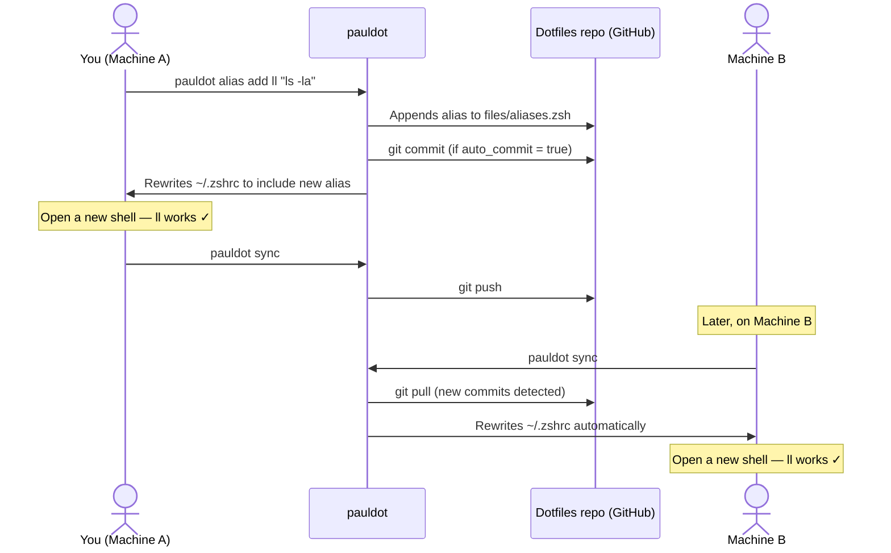

# Alias lifecycle

This flow covers adding a new alias on one machine, applying it, syncing it to the remote, and picking it up on a second machine.

---

## Overview



---

## Step by step

### 1. Add the alias

```sh
pauldot alias add ll "ls -la"
```

This appends `alias ll="ls -la"` to `files/aliases.zsh` in your dotfiles repo. If `git.auto_commit = true`, the change is committed immediately.

### 2. Use it locally

`alias add` rewrites `~/.zshrc` automatically — no separate `apply` needed. Open a new shell (or `source ~/.zshrc`) to use the alias.

!!! tip "Create a reload alias"
    Add a `reload` alias to your dotfiles repo that sources `~/.zshrc`, so you can run `reload` instead of opening a new shell every time you add an alias.

### 3. Push to the remote

```sh
pauldot sync
```

`sync` runs `git pull --rebase` then pushes any local commits. After this, the alias is in the remote repo.

### 4. Pull it on another machine

On Machine B:

```sh
pauldot sync
```

`sync` pulls the latest dotfiles and, when new commits are detected, rewrites `~/.zshrc` automatically. Open a new shell — the alias is available.

---

## Notes

- `pauldot alias list` shows all aliases currently defined in your dotfiles.
- If you want to remove an alias, edit `files/aliases.zsh` directly (`pauldot edit zshrc` opens it in `$EDITOR`), then `apply` and `sync`.
- Aliases live in `files/aliases.zsh` which is sourced by every generated `~/.zshrc`, regardless of profile.
