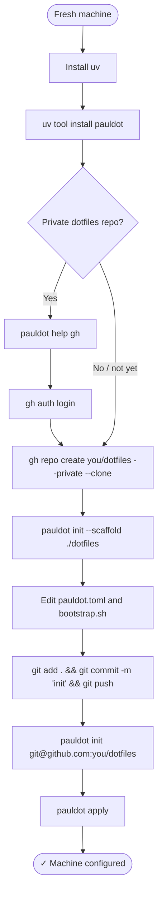

# Bootstrap a new machine

This flow covers setting up pauldot **for the first time ever** i.e. creating your dotfiles repo from scratch and getting your first machine under management.

---

## Overview



---

## Step by step

### 1. Install uv

pauldot is distributed via [uv](https://github.com/astral-sh/uv). Install it first:

```sh
curl -LsSf https://astral.sh/uv/install.sh | sh
```

### 2. Install pauldot

```sh
uv tool install pauldot
pauldot --install-completion && exec zsh
```

### 3. Authenticate with GitHub (private repos)

If your dotfiles repo will be private, set up GitHub CLI before proceeding:

```sh
pauldot help gh   # walks you through gh auth login
```

### 4. Create and scaffold your dotfiles repo

```sh
gh repo create you/dotfiles --private --clone
pauldot init --scaffold ./dotfiles
```

This writes the skeleton: `pauldot.toml`, `profiles/`, `files/`, `tools/`, and `bootstrap.sh`.

### 5. Configure

Edit `pauldot.toml` — set your `default_profile`, `git.visibility`, and anything else you want.

Edit `bootstrap.sh` — set `PAULDOT_REPO` to your repo's SSH URL.

### 6. Commit and push

```sh
cd dotfiles && git add . && git commit -m "init" && git push
```

### 7. Apply

```sh
pauldot init git@github.com:you/dotfiles
pauldot apply
```

`apply` writes `~/.zshrc` from your source files and installs any declared tools.

Open a new shell — you're done.

---

## On every subsequent machine

```sh
curl -sSL https://raw.githubusercontent.com/you/dotfiles/main/bootstrap.sh | sh
```

Or manually:

```sh
uv tool install pauldot
pauldot --install-completion && exec zsh
pauldot init git@github.com:you/dotfiles
pauldot apply
```
