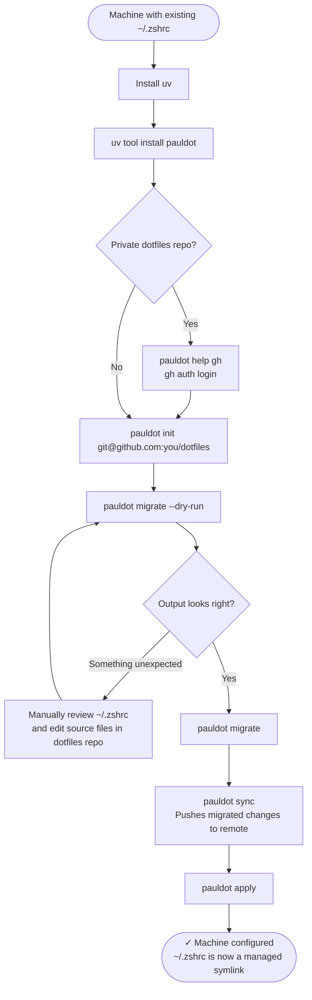

# Migrate an existing machine

This flow covers adding pauldot to a machine that **already has a `~/.zshrc`** with aliases, exports, and tool config you want to keep — and an existing dotfiles repo you want to bring it under.

The key tool here is `pauldot migrate`, which reads your existing `~/.zshrc` before pauldot touches anything and distributes the content into your dotfiles source files. You review and commit the result, then run `apply`.

---

## Overview



---

## What `migrate` does

`pauldot migrate` reads your current `~/.zshrc` (which must be a real file, not already a symlink) and splits it:

- Lines starting with `alias foo=` → appended to `files/aliases.zsh`
- Everything else (exports, tool init, path manipulation) → written to `files/zshrc.base`

Aliases that already exist in `aliases.zsh` are skipped to avoid duplicates.

Use `--dry-run` first to see exactly what will be written before anything changes.

---

## Step by step

### 1. Install uv and pauldot

```sh
curl -LsSf https://astral.sh/uv/install.sh | sh
uv tool install pauldot
```

### 2. Authenticate and init

If your dotfiles repo is private:

```sh
pauldot help gh   # walks you through gh auth login
```

Then clone your repo and set the active profile:

```sh
pauldot init git@github.com:you/dotfiles
```

### 3. Preview the migration

```sh
pauldot migrate --dry-run
```

This shows you what would be written to `files/aliases.zsh` and `files/zshrc.base` — without touching anything.

Check for:

- Aliases you no longer want (you can delete them from the dotfiles source files after migration)
- Tool init blocks (nvm, pyenv, rbenv, etc.) that might conflict with what's already in your base config

### 4. Run the migration

```sh
pauldot migrate
```

The result is written into your local `~/.pauldot/` repo clone. If `git.auto_commit = true` in `pauldot.toml`, the changes are committed automatically.

### 5. Review and push

```sh
pauldot sync
```

This pushes the migrated changes so other machines can pull them.

### 6. Apply

```sh
pauldot apply
```

Your existing `~/.zshrc` is backed up to `~/.zshrc.bak.<timestamp>`, and a new symlink is created pointing at the generated file. Open a new shell to pick up the changes.

---

## If something looks wrong after apply

The backup is always at `~/.zshrc.bak.<timestamp>`. You can diff it against the generated file:

```sh
diff ~/.zshrc.bak.* ~/.zshrc
```

To adjust, edit the source files in `~/.pauldot/files/`, run `pauldot apply` again, and `pauldot sync` when you're happy.
