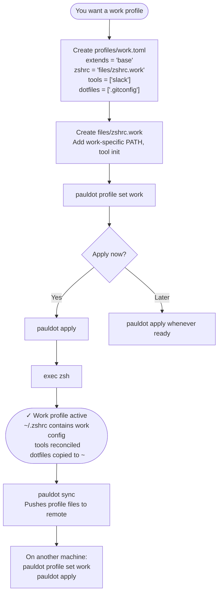

# Profile lifecycle

This flow covers creating a new profile, activating it, and using it across machines.

---

## What profiles are

A profile is a named slice of your dotfiles config. Every machine has one active profile at a time. Profiles can extend a shared `base` profile, adding their own zshrc source file, tools, and tracked dotfiles on top.

A typical setup:

- `base` — shared across everything: aliases, common tools, starship
- `personal` — extends base; adds personal PATH tweaks and personal tools
- `work` — extends base; adds work PATH, work-only tools (`slack`, `zed`), a `.gitconfig` with your work email

---

## Overview



---

## Step by step

### 1. Create a profile file

In your dotfiles repo, create `profiles/work.toml`:

```toml
extends = "base"

zshrc = "files/zshrc.work"

tools = ["slack", "zed", "ripgrep"]

dotfiles = [".gitconfig"]
```

- `extends` — inherit everything from `base` and add on top
- `zshrc` — a profile-specific source file (PATH tweaks, tool init, exports)
- `tools` — tools to install on any machine running this profile
- `dotfiles` — files in `files/home/` to copy to `~` on apply (if missing)

### 2. Create the profile's zshrc source file

```sh
touch ~/.pauldot/files/zshrc.work
```

Add any work-specific config:

```zsh
export WORK_MODE=true
export EDITOR="zed --wait"
export PATH="$HOME/.work/bin:$PATH"
```

### 3. Set the active profile

```sh
pauldot profile set work
```

You'll be asked whether to apply immediately. You can also pass `--apply` to skip the prompt:

```sh
pauldot profile set work --apply
```

### 4. Apply and reload

```sh
pauldot apply
exec zsh
```

`apply` writes `~/.zshrc` from the work profile's source files, reconciles tool installs, and links any tracked dotfiles listed in `dotfiles`.

---

## Switching back

```sh
pauldot profile set personal --apply
exec zsh
```

The previous profile's zshrc content is replaced; tools from the new profile are reconciled on the next apply.

---

## Using a profile on another machine

```sh
pauldot profile set work
pauldot apply
```

The profile file (`profiles/work.toml`) is already in the repo. Setting it and applying is all that's needed.

---

## Notes

- `pauldot profile list` shows all available profiles.
- `pauldot profile show` shows the currently active profile.
- Only one profile is active per machine at a time. Each machine can run a different profile from the same repo.
- `extends` is single-level only — `work` extends `base`, but `base` cannot itself extend another profile.
