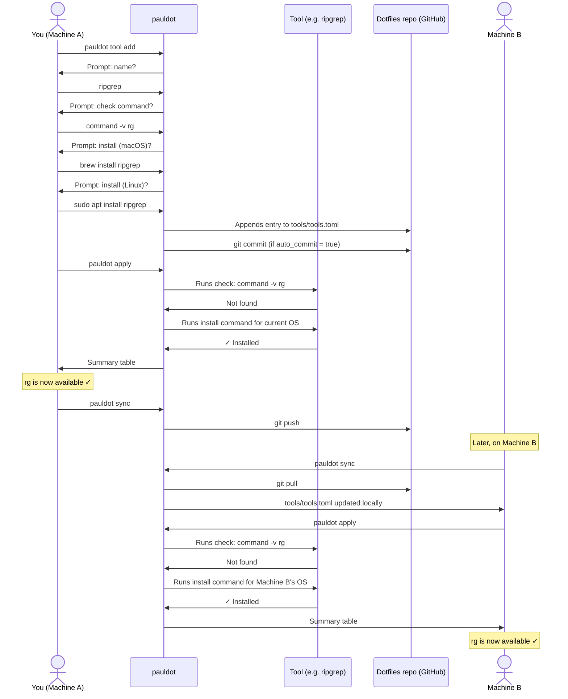

# Tool lifecycle

This flow covers declaring a new tool, installing it on the current machine, syncing the declaration to the remote, and having it automatically installed on another machine.

---

## Overview



---

## Step by step

### 1. Declare the tool

```sh
pauldot tool add
```

You'll be prompted for:

- **Name** — a short identifier (e.g. `ripgrep`)
- **Check command** — a shell expression that exits 0 if the tool is present (e.g. `command -v rg`)
- **Install command (macOS)** — what to run to install it on macOS
- **Install command (Linux)** — what to run to install it on Linux

Either install command can be left blank — the tool is silently skipped on that OS.

The entry is appended to `tools/tools.toml`:

```toml
[[tool]]
name = "ripgrep"
check = "command -v rg"
install.macos = "brew install ripgrep"
install.linux = "sudo apt install ripgrep"
```

### 2. Install it locally

```sh
pauldot apply
```

For each tool in your active profile, `apply` runs the check command. If it exits non-zero (tool missing), the install command for the current OS is executed. The result is printed in a summary table.

Tool install failures do **not** abort the loop — each failure is reported and the run continues.

To install a single tool by name without a full apply:

```sh
pauldot tool install ripgrep
```

### 3. Push to the remote

```sh
pauldot sync
```

Pushes the updated `tools/tools.toml` to the remote.

### 4. Install on another machine

On Machine B:

```sh
pauldot sync    # pulls the latest dotfiles, including the new tool declaration
pauldot apply   # detects the tool is missing, runs the install command
```

The right install command is picked automatically based on that machine's OS.

---

## Notes

- `pauldot tool list` shows all declared tools and whether each is currently installed.
- Tools are declared globally in `tools/tools.toml` but only installed if they appear in the active profile's `tools = [...]` list.
- To remove a tool declaration: `pauldot tool remove <name>`. This removes it from `tools.toml` but does not uninstall the binary from your system.
- OS detection is centralised — `macos` or `linux` only. The matching install command is chosen at apply time.
