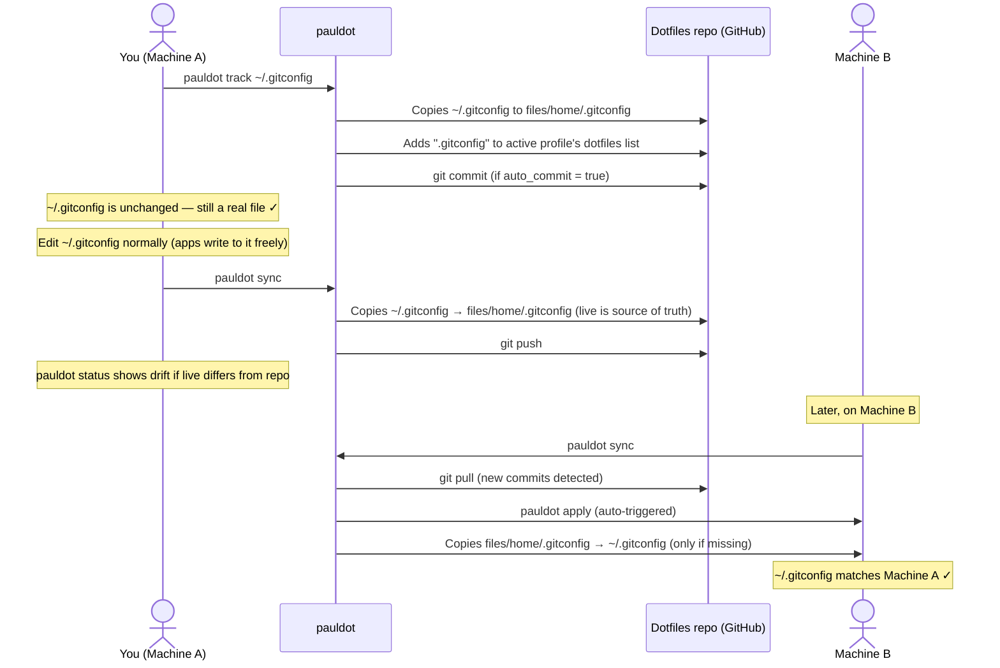

# Track a dotfile

This flow covers tracking a dotfile (like `.gitconfig`) in your repo and keeping it in sync across machines.

---

## What tracking means

"Tracking" a dotfile means copying it into your dotfiles repo under `files/home/` and adding it to the active profile's `dotfiles` list. On every subsequent `apply`, pauldot copies the repo version to `~` if the file is missing on that machine.

The live file stays a real file — not a symlink. You edit it normally. When you run `pauldot sync`, the live version is copied back into the repo and pushed.

---

## Overview



---

## Step by step

### 1. Track the file

```sh
pauldot track ~/.gitconfig
```

This:

1. Copies `~/.gitconfig` to `files/home/.gitconfig` in your repo
2. Adds `".gitconfig"` to the active profile's `dotfiles` list in `profiles/<name>.toml`
3. Commits the change if `git.auto_commit = true`

Your local `~/.gitconfig` is untouched.

### 2. Edit the file normally

You don't need to do anything special. Apps like `git config --global` write directly to `~/.gitconfig`. That's fine — the live file is always the source of truth.

### 3. Sync live changes to the repo

```sh
pauldot sync
```

`sync` copies `~/.gitconfig` → `files/home/.gitconfig`, commits, and pushes. Any drift between the live file and the repo version is captured here.

To preview what's out of sync before pushing:

```sh
pauldot status
```

### 4. Bootstrap on another machine

On a fresh machine after `pauldot init` and `pauldot apply`:

```sh
pauldot apply
```

For each file in the active profile's `dotfiles` list that doesn't exist on the machine, pauldot copies it from `files/home/` to `~/`. Existing files are left alone unless you pass `--overwrite`:

```sh
pauldot apply --overwrite   # copies repo version to ~/, backs up the existing file first
```

---

## File layout

Tracked dotfiles live under `files/home/` in the repo, mirroring their location relative to `~`:

```
files/home/
├── .gitconfig
└── .config/
    └── starship.toml
```

`files/home/.gitconfig` → `~/.gitconfig`  
`files/home/.config/starship.toml` → `~/.config/starship.toml`

---

## Notes

- Tracking is per-profile. A file tracked in `work` won't appear on a machine running `personal` unless you also add it to `personal`.
- `pauldot apply` only copies files that are **missing** on the target machine. It never silently overwrites a file that already exists locally. Use `--overwrite` (with backup) to pull the repo version.
- If both machines edit a tracked file between syncs, `pauldot sync` will detect the conflict and eject — resolve it manually or run `pauldot apply --overwrite` to accept the repo version.
- For files that tools write to constantly (shell history, browser state), don't track them — they'll conflict on every sync.
